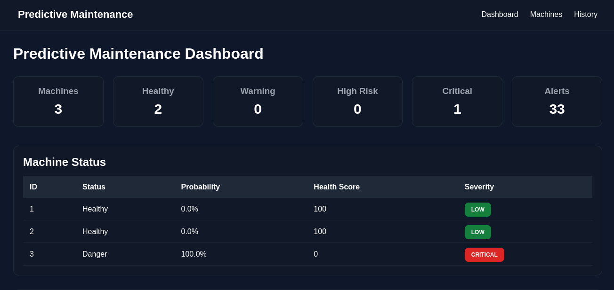
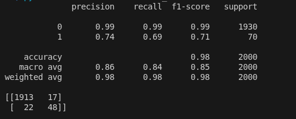
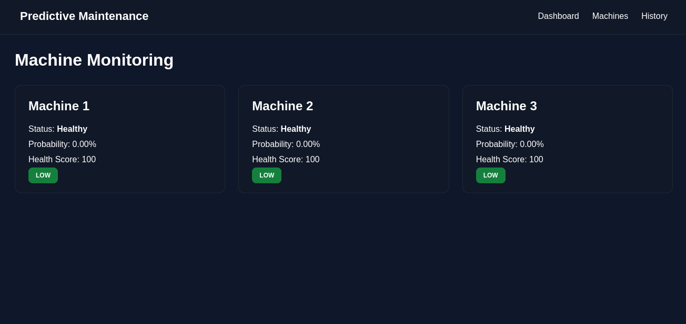
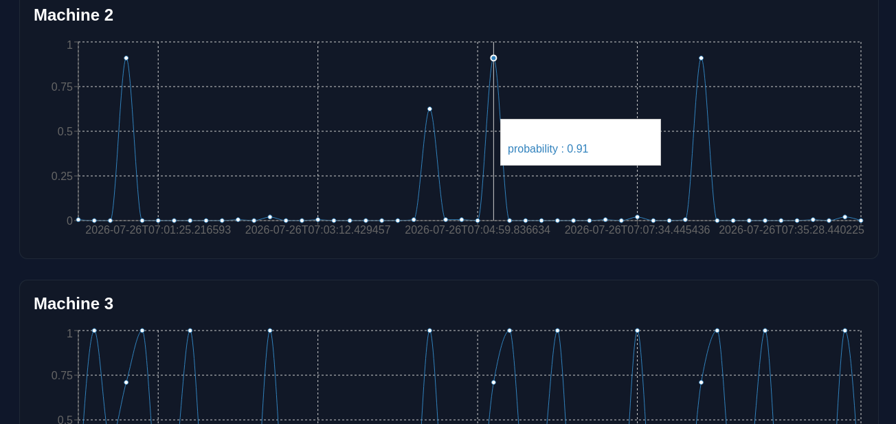
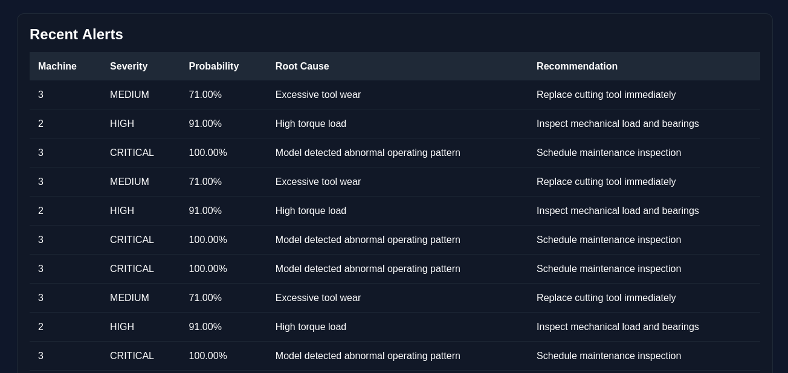

# Industrial Predictive Maintenance Platform



A full-stack machine learning platform that continuously monitors industrial equipment, predicts failures before breakdowns occur, generates automated maintenance alerts, tracks machine health history, and visualizes operational risk through an interactive monitoring dashboard.

The system combines Machine Learning, FastAPI, React, SQL databases, automated email notifications, and Dockerized deployment to simulate a real-world predictive maintenance workflow used in modern industrial environments.

---

## 🚀 Hackathon & Industry Recognition

Built as part of an AI/ML hackathon at **AIT College**, where our team developed this project from concept to working prototype.

The project received industry recognition and resulted in an **AIML internship opportunity at a startup company** after the hackathon.

---

# Problem Statement

Unexpected machine failures are one of the most expensive challenges in manufacturing and industrial operations.

A single equipment breakdown can lead to:

- Production downtime
- Increased maintenance costs
- Reduced operational efficiency
- Equipment damage
- Safety risks

Traditional maintenance strategies are reactive, meaning repairs occur only after a failure has already happened.

This project demonstrates how machine learning can be used to identify early warning signs of failure and enable proactive maintenance before a breakdown occurs.

---

# Key Features

### Real-Time Machine Monitoring

Monitors multiple industrial machines simultaneously using continuously streamed sensor readings.

### Failure Prediction Engine

Uses a trained Machine Learning model to predict:

- Healthy
- Danger

Provides:

- Failure probability
- Health score
- Severity classification
- Root cause analysis
- Maintenance recommendations

### Automated Email Alerting

When critical conditions are detected:

- Alerts are generated automatically
- Alerts are stored in the database
- Email notifications are sent to maintenance personnel

### Historical Analytics

Stores machine history for:

- Trend analysis
- Health tracking
- Failure investigation
- Maintenance planning

### Interactive Dashboard

Provides:

- Fleet health overview
- Machine status monitoring
- Active alerts
- Historical prediction trends

### Dockerized Deployment

The complete application runs using Docker and Docker Compose.

---

# System Architecture

```text
Industrial Machines
        │
        ▼
Sensor Stream Simulation
        │
        ▼
Prediction Service
        │
        ▼
Machine Learning Model
        │
        ▼
Failure Prediction Engine
        │
 ┌──────┴──────┐
 ▼             ▼
Alerts      Database
 ▼             ▼
Email      Historical Data
                │
                ▼
          FastAPI API
                │
                ▼
         React Dashboard
```

---

# Tech Stack

## Backend

- FastAPI
- SQLAlchemy
- SQLite
- Uvicorn

## Machine Learning

- Scikit-Learn
- Pandas
- NumPy
- Joblib
- XGBoost
- MLflow

## Frontend

- React
- Axios
- Recharts
- React Router

## DevOps

- Docker
- Docker Compose

---

# Machine Learning Pipeline

## Dataset

This project uses the AI4I 2020 Predictive Maintenance Dataset.

Original dataset:
AI4I 2020 Predictive Maintenance Dataset by S. Matzka (2020)

Source:
UCI Machine Learning Repository

License:
CC BY 4.0

## Dataset Limitations

The AI4I Predictive Maintenance dataset is a benchmark dataset and does not fully represent the complexity of production industrial environments.

Real-world deployments require handling:
- Sensor noise
- Data drift
- Machine-specific behavior
- Long-term operational changes

This project focuses on building an end-to-end predictive maintenance pipeline while addressing the challenge of rare failure events through imbalance-aware modeling.

### Input Features

- Air Temperature
- Process Temperature
- Rotational Speed
- Torque
- Tool Wear

### Model

Random Forest Classifier

### Output

- Failure Prediction
- Failure Probability
- Health Score
- Severity Level

---
# Model Performance

| Metric | Score |
|----------|----------|
| Accuracy | 98% |
| Precision (Failure Class) | 74% |
| Recall (Failure Class) | 69% |
| F1 Score (Failure Class) | 71% |

### Evaluation Results



### Class Imbalance Handling

The AI4I Predictive Maintenance dataset is highly imbalanced, with failure events representing a small fraction of total observations.

To improve minority-class detection, multiple imbalance mitigation strategies were evaluated, including:

- Stratified train-test splitting
- Class-weighted Random Forest training
- SMOTE-based oversampling

While SMOTE increased failure recall, it also introduced a significant number of false positives and reduced overall precision. The final deployed model uses class-weighted training, providing a more balanced trade-off between precision and recall for predictive maintenance scenarios.

> In industrial environments, both missed failures and excessive false alarms carry operational costs. The selected model configuration was chosen to maintain balanced predictive performance while minimizing unnecessary maintenance actions.
---


---

# Model Comparison

To evaluate alternative approaches for failure prediction, both Random Forest and XGBoost classifiers were trained and tested on the same stratified train-test split.

### Comparison Results

| Model | Accuracy | Precision | Recall | F1 Score |
|---------|---------|---------|---------|---------|
| Random Forest | 98.05% | 73.85% | 68.57% | 71.11% |
| XGBoost | 98.30% | 87.50% | 60.00% | 71.19% |

### Confusion Matrices

#### Random Forest

```text
[[1913   17]
 [  22   48]]
```

#### XGBoost

```text
[[1924    6]
 [  28   42]]
```

### Model Selection Rationale

Although XGBoost achieved a marginally higher F1 Score, the difference was negligible.

For predictive maintenance systems, failure detection recall is often more important than maximizing overall accuracy because missed failures can lead to costly downtime and equipment damage.

The Random Forest model achieved:

- Higher failure recall
- More balanced predictive behavior
- Simpler deployment and maintenance
- Faster training and inference

Based on these trade-offs, Random Forest was selected as the production model for the platform.


# Dashboard Screenshots

## Dashboard Overview


---

## Machine Monitoring



---

## Historical Analytics



---

## Alert Management



---

# Project Structure

```text
predictive-maintenance/

├── backend/
│   ├── api/
│   ├── database/
│   ├── ml/
│   ├── services/
│   └── main.py
│
├── frontend/
│   ├── src/
│   ├── public/
│   └── package.json
│
├── data/
│   └── ai4i_clean.csv
│
├── models/
│   └── baseline.joblib
│
├── docs/
│   ├── dashboard.png
│   ├── machines.png
│   ├── history.png
│   ├── alerts.png
│   └── model_metrics.png
│
├── docker-compose.yml
├── requirements.txt
└── README.md
```

---

# Running the Project

## Clone Repository

```bash
git clone https://github.com/hajirabanu05/predictive-maintenance-platform.git

cd predictive-maintenance-platform 
```

## Run Using Docker

```bash
docker compose up --build
```

## Frontend

```text
http://localhost:5173
```

## Backend API

```text
http://localhost:8000
```

## API Documentation

```text
http://localhost:8000/docs
```

---

# Future Improvements

- Kafka-based real-time sensor streaming
- MQTT integration for IoT device communication
- PostgreSQL migration for production-scale storage
- Cloud deployment on AWS
- CI/CD pipeline using GitHub Actions
- Kubernetes orchestration for scalable deployment
- Explainable AI using SHAP-based feature attribution

---

# Contributors

### Hajira Banu

- Designed and developed the FastAPI backend
- Built the Machine Learning prediction pipeline
- Developed the React monitoring dashboard
- Implemented historical analytics and alert management
- Integrated automated email notification workflows
- Dockerized the complete application

GitHub: https://github.com/hajirabanu05

LinkedIn: https://www.linkedin.com/in/hajira-banu-688789323/